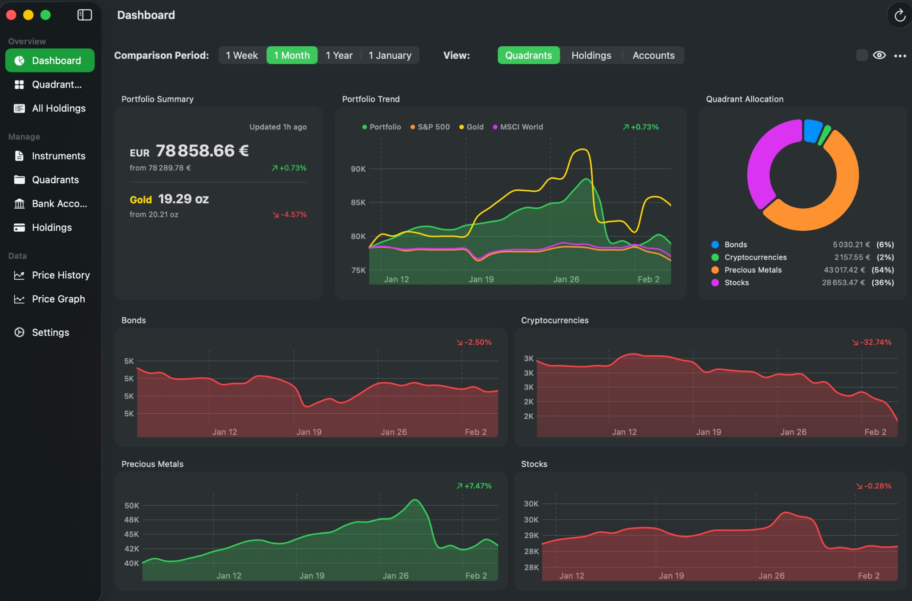
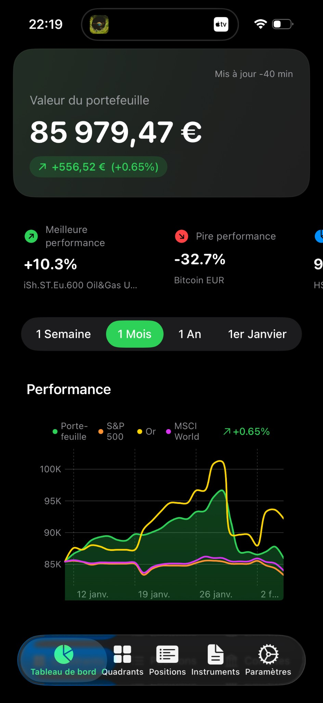
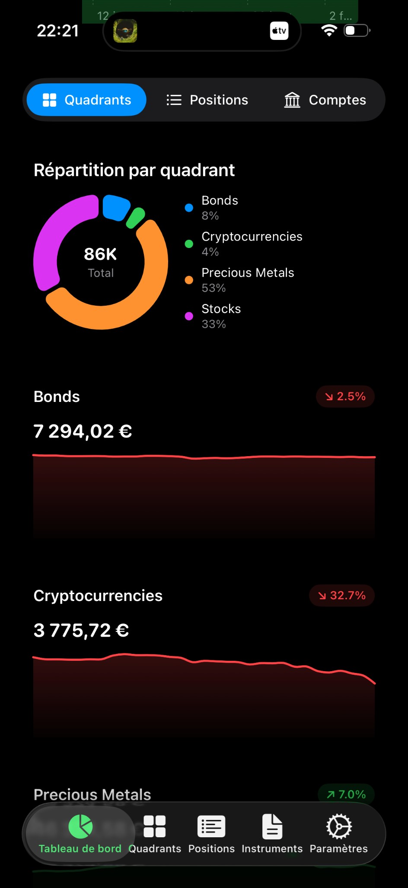
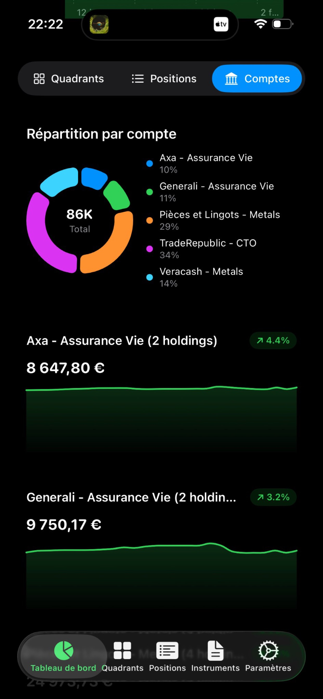
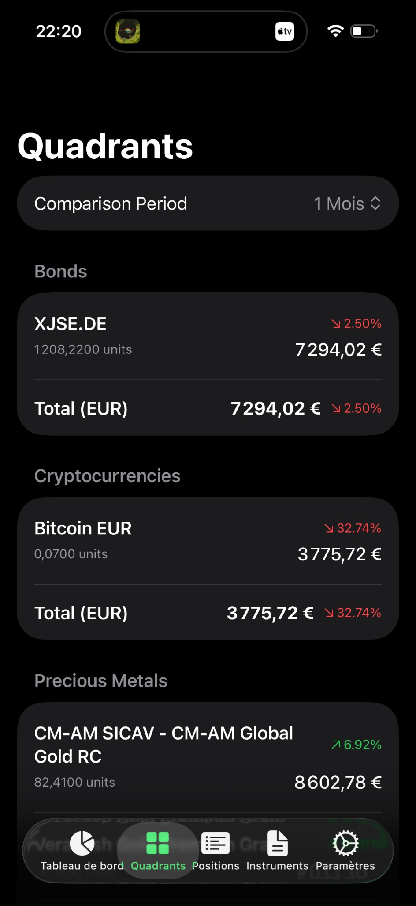
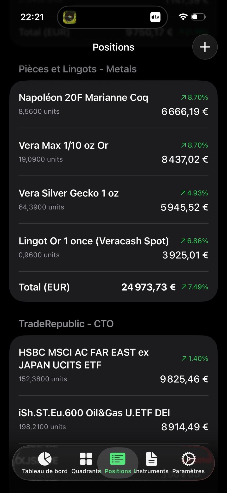

# Portfolio - Portfolio Tracker

[](LICENSE)
[](https://developer.apple.com/ios/)
[](https://developer.apple.com/macos/)
[](https://swift.org)

**Portfolio** is a comprehensive, privacy-focused portfolio tracker for managing your financial assets. Track stocks, ETFs, mutual funds, precious metals, cryptocurrencies, and bank accounts—all in one place with beautiful native apps for iOS and macOS.

### Privacy disclaimer

This application is designed **privacy-first**. Your portfolio data (instruments, holdings, accounts, prices history) are stored **only on your device** in a local SQLite database. There is **no backend server**; no personal or financial data is sent to any server. Optional iCloud storage uses your own Apple account to sync the same local database across your devices—you remain in control. Price updates request only public market data (e.g. tickers or ISINs) from public APIs; no account linking or personally identifiable information is ever transmitted.

---

## Table of Contents

- [Overview](#overview)
- [Key Features](#key-features)
- [Supported Asset Types](#supported-asset-types)
- [Getting Started](#getting-started)
  - [iOS & macOS App](#ios--macos-app)
  - [Command Line Interface](#command-line-interface)
- [User Guide](#user-guide)
  - [Dashboard](#dashboard)
  - [Managing Instruments](#managing-instruments)
  - [Bank Accounts & Holdings](#bank-accounts--holdings)
  - [Quadrants (Portfolio Organization)](#quadrants-portfolio-organization)
  - [Reports & Analytics](#reports--analytics)
  - [Price Management](#price-management)
  - [Settings & Preferences](#settings--preferences)
- [Data Sources](#data-sources)
- [Privacy & Security](#privacy--security)
- [Automation](#automation)
- [Development](#development)
- [License](#license)

---

## Overview

Portfolio helps you take control of your investment portfolio by consolidating all your financial assets into a single, unified view. Whether you're tracking stocks across multiple brokers, monitoring your gold coins, or analyzing your mutual fund performance, Portfolio provides the tools you need.

### Screenshots

#### macOS



#### iOS

<p float="left">
  
  
  
  
  
</p>

### Why Portfolio?

- **All-in-One Tracking**: Stocks, ETFs, mutual funds, cryptocurrencies, precious metals, and bank accounts in one app
- **Accurate Data**: Fetches real NAV values for mutual funds (not stale exchange prices) and includes market premiums for physical gold/silver
- **Multi-Currency Support**: Automatic USD/EUR conversion with historical exchange rates
- **Privacy-First**: All data stored locally on your device—no cloud accounts required
- **Native Experience**: Beautiful SwiftUI apps optimized for both iOS and macOS
- **Offline Access**: View your portfolio anytime, even without internet connection

---

## Key Features

### Portfolio Management
- **Multi-Account Support**: Track holdings across multiple bank accounts and brokers
- **Cost Basis Tracking**: Record purchase dates and prices for accurate gain/loss calculations
- **Quadrant Organization**: Group instruments by category (Technology, Precious Metals, Fixed Income, etc.)

### Analytics & Reporting
- **Performance Comparison**: Compare your portfolio over different periods (1 day, 1 week, 1 month, 1 year, YTD)
- **Interactive Charts**: View portfolio trends, allocation breakdowns, and individual instrument price history
- **Gold Valuation**: See your portfolio value in gold ounces for inflation-adjusted perspective

### Data Management
- **Smart Fetching**: Automatically selects the best data source for each instrument type
- **Historical Backfilling**: Import years of historical data for comprehensive trend analysis
- **Background Updates**: Automatic price updates on macOS and iOS

### User Experience
- **Privacy Mode**: Quickly hide sensitive values while keeping the app functional
- **Bilingual Support**: Full English and French localization
- **Dark Mode**: Native support for system appearance preferences

---

## Supported Asset Types

| Asset Type | Examples | Data Source | Notes |
|------------|----------|-------------|-------|
| **Stocks** | Apple (AAPL), Tesla (TSLA) | Yahoo Finance | Real-time market prices |
| **ETFs** | MSCI World, S&P 500 | Yahoo Finance | Exchange-traded funds |
| **Mutual Funds (OPCVMs)** | Amundi, Carmignac | Financial Times | Accurate NAV from Morningstar |
| **Cryptocurrencies** | Bitcoin, Ethereum | Yahoo Finance | Major crypto pairs |
| **Precious Metals** | Gold, Silver | Veracash | Spot prices in EUR/gram |
| **Gold & Silver Coins** | Napoléon, Vera Max | AuCOFFRE | Includes market premiums |
| **Bank Accounts** | Manual entry | N/A | Cash position tracking |

### Special Instrument Types

#### Precious Metals (Veracash)
Track spot prices for gold and silver per gram in EUR:
- `VERACASH:GOLD_SPOT` - Gold spot price
- `VERACASH:GOLD_PREMIUM` - Gold premium price
- `VERACASH:SILVER_SPOT` - Silver spot price

#### Physical Coins (AuCOFFRE)
Physical coins include market premiums that vary based on demand:
- `COIN:NAPOLEON_20F` - Napoléon 20F Marianne Coq (~5.8g pure gold)
- `COIN:VERAMAX_GOLD_1/10OZ` - Vera Max 1/10 oz gold
- `COIN:GECKO_SILVER_1OZ` - Vera Silver Gecko 1 oz
- `COIN:GOLD_BAR_1OZ` - Gold bar 1 oz (spot estimate)

---

## Getting Started

### iOS & macOS App

The native SwiftUI application provides the best experience for tracking your portfolio.

#### System Requirements
- **iOS**: iOS 17.0 or later (iPhone and iPad)
- **macOS**: macOS 14.0 Sonoma or later

#### Installation from Xcode

1. Clone the repository:
   ```bash
   git clone https://github.com/jeremycalles/Portfolio.git
   cd Portfolio
   ```

2. Open the Xcode project:
   ```bash
   open PortfolioMultiplatform.xcodeproj
   ```

3. Select your target:
   - **Portfolio iOS** for iPhone/iPad
   - **Portfolio macOS** for Mac

4. Build and run (`Cmd+R`)

#### First Launch

When you first launch Portfolio:
1. The app creates a local SQLite database for your data
2. Your preferred language is detected from system settings
3. You can start adding instruments and bank accounts immediately

### Command Line Interface

For advanced users and automation, Portfolio may include a Python CLI (optional; not all assets are in this repo). The following is for reference if you have or add a CLI.

#### Prerequisites
- Python 3.8 or later
- pip (Python package manager)

#### Setup

```bash
# Navigate to the project directory (after cloning)
cd Portfolio

# Create and activate virtual environment
python3 -m venv venv
source venv/bin/activate  # Windows: venv\Scripts\activate

# Install dependencies
pip install -r requirements.txt

# Initialize the database (if CLI is available)
python3 src/main.py init
```

---

## User Guide

### Dashboard

The Dashboard is your portfolio command center, providing an instant overview of your financial position.

#### Portfolio Summary
At the top, you'll see:
- **Total Portfolio Value**: Sum of all holdings converted to EUR
- **Gold Equivalent**: Your portfolio value expressed in gold ounces (using current spot price)
- **Period Change**: Percentage change compared to your selected comparison period

#### Comparison Periods
Use the period selector to compare your portfolio against:
- **1 Day**: Yesterday's closing values
- **1 Week**: Values from 7 days ago
- **1 Month**: Values from 30 days ago
- **1 Year**: Values from 365 days ago
- **YTD (Year-to-Date)**: Values from January 1st

#### Portfolio Chart
The interactive chart shows your portfolio value over time:
- **Line Chart**: Track the trend of your total portfolio value
- **Time Ranges**: 1M, 3M, 6M, YTD, 1Y, 2Y, All
- **Gold Mode**: Toggle to view values in gold ounces instead of EUR

#### Allocation Views
Switch between different allocation perspectives:
- **By Quadrant**: See how your portfolio is distributed across asset categories
- **By Account**: View allocation across your bank accounts
- **By Holdings**: Individual instrument breakdown

#### Privacy Mode
Toggle the eye icon to hide sensitive values. The app remains fully functional but displays masked values—useful when viewing in public.

---

### Managing Instruments

Instruments are the financial assets you want to track (stocks, ETFs, funds, etc.).

#### Adding Instruments

**In the App:**
1. Navigate to **Instruments** (macOS sidebar) or **Portfolio** tab (iOS)
2. Click/tap the **+** button
3. Enter the identifier:
   - **ISIN** (12 characters): e.g., `LU0389656892` for mutual funds
   - **Ticker**: e.g., `AAPL` for stocks, `BTC-EUR` for crypto
   - **Special Key**: e.g., `VERACASH:GOLD_SPOT` for precious metals

**Via CLI:**
```bash
# Stocks & ETFs
python3 src/main.py add AAPL           # By ticker
python3 src/main.py add US0378331005   # By ISIN

# Mutual Funds
python3 src/main.py add LU1861134382   # Amundi MSCI World

# Cryptocurrencies
python3 src/main.py add BTC-EUR        # Bitcoin in EUR

# Precious Metals
python3 src/main.py add VERACASH:GOLD_SPOT

# Physical Coins
python3 src/main.py add COIN:NAPOLEON_20F
```

#### Viewing Instrument Details

Click/tap on any instrument to view:
- **Current Price**: Latest fetched price with currency
- **Price History**: Historical prices in table or chart format
- **Assigned Quadrant**: Category grouping
- **Holdings**: Which accounts hold this instrument

#### Deleting Instruments

**Important:** Deleting an instrument removes all associated price history and holdings.

1. Select the instrument
2. Click/tap the delete button (trash icon)
3. Confirm the deletion

---

### Bank Accounts & Holdings

Track your investments across multiple brokers and accounts.

#### Adding Bank Accounts

**In the App:**
1. Navigate to **Accounts** section
2. Click/tap the **+** button
3. Enter:
   - **Name**: Account name (e.g., "TradeRepublic")
   - **Type**: Account type (e.g., "CTO", "PEA", "Checking")

**Via CLI:**
```bash
python3 src/main.py add-account "TradeRepublic" "CTO"
python3 src/main.py add-account "Boursorama" "PEA"
```

#### Adding Holdings

Holdings represent how many units of an instrument you own in each account.

**In the App:**
1. Navigate to **Holdings** section
2. Click/tap the **+** button
3. Select:
   - **Account**: Which bank account
   - **Instrument**: Which asset
   - **Quantity**: Number of units
   - **Purchase Date** (optional): When you bought
   - **Purchase Price** (optional): Price per unit at purchase

**Via CLI:**
```bash
# Basic holding
python3 src/main.py add-holding "TradeRepublic" AAPL 10

# With purchase tracking
python3 src/main.py add-holding "TradeRepublic" BTC-EUR 0.5 \
  --purchase-date 2024-01-15 \
  --purchase-price 35000
```

#### Viewing Holdings

The Holdings view shows:
- **Grouped by Account**: See all instruments in each account
- **Current Value**: Quantity × current price
- **Gain/Loss**: If purchase data is recorded, see unrealized gains

#### All Holdings View

Access the consolidated view to see:
- All holdings across all accounts
- Total portfolio value
- Expandable account sections

---

### Quadrants (Portfolio Organization)

Quadrants help you categorize and analyze your portfolio by asset type or strategy.

#### Creating Quadrants

Suggested quadrant categories:
- **Technology**: Tech stocks and ETFs
- **Precious Metals**: Gold, silver, and coins
- **Fixed Income**: Bonds and money market funds
- **International**: Emerging markets and foreign stocks
- **Real Estate**: REITs and real estate funds

**In the App:**
1. Navigate to **Quadrants** section
2. Click/tap the **+** button
3. Enter a name for the quadrant

**Via CLI:**
```bash
python3 src/main.py add-quadrant "Technology"
python3 src/main.py add-quadrant "Precious Metals"
```

#### Assigning Instruments to Quadrants

**In the App:**
1. Select an instrument
2. Choose a quadrant from the dropdown/picker

**Via CLI:**
```bash
python3 src/main.py assign-quadrant AAPL "Technology"
python3 src/main.py assign-quadrant "VERACASH:GOLD_SPOT" "Precious Metals"
```

#### Quadrant Reports

View your portfolio grouped by quadrant:
- Subtotal value per quadrant
- Percentage of total portfolio
- Performance change per quadrant
- Pie chart visualization

---

### Reports & Analytics

#### Portfolio Report

The Portfolio Report shows detailed analysis of your holdings:

| Column | Description |
|--------|-------------|
| Instrument | Name and identifier |
| Quantity | Units held |
| Current Price | Latest price |
| Current Value | Quantity × price in EUR |
| Change | Percentage change vs comparison period |

**Comparison Periods:**
- `1 Day`: Compare to yesterday
- `1 Week`: Compare to 7 days ago
- `1 Month`: Compare to 30 days ago
- `1 Year`: Compare to 365 days ago
- `YTD`: Compare to January 1st

**Via CLI:**
```bash
python3 src/portfolio_report.py "TradeRepublic" --period 1Year
```

#### Quadrant Report

See your portfolio organized by category:
- Holdings grouped under each quadrant
- Quadrant subtotals with change percentages
- Grand total across all quadrants
- Unassigned instruments section

**Via CLI:**
```bash
python3 src/quadrant_report.py --period 1Year
python3 src/quadrant_report.py "Precious Metals" --period 1Week
```

#### Price Graphs

Interactive charts for individual instruments:
- **Time Ranges**: 1M, 3M, 6M, YTD, 1Y, 2Y, All
- **Statistics**: Min, Max, Average, Data Points
- **Smooth Curves**: Catmull-Rom interpolation for better visualization

---

### Price Management

#### Automatic Updates

Portfolio automatically fetches latest prices from data sources.

**Manual Update:**
- **In App**: Settings → Update All Prices
- **Via CLI**: `python3 src/main.py update`

#### Historical Backfilling

Import historical data for trend analysis:

**In App:**
1. Go to Settings
2. Select "Backfill Historical Data"
3. Choose period (1Y, 2Y, 5Y, Max)

**Via CLI:**
```bash
# Last year, monthly data
python3 src/main.py backfill-historical

# Last 5 years, weekly data
python3 src/main.py backfill-historical --period 5y --interval 1wk

# Maximum available history
python3 src/main.py backfill-historical --period max
```

#### Manual Price Entry

For instruments without automatic data sources:
1. Navigate to **Price History**
2. Select the instrument
3. Click/tap **+** to add a new price
4. Enter date and price value

---

### Settings & Preferences

#### Language

Switch between English and French:
1. Go to **Settings**
2. Select **Language**
3. Choose your preferred language

The app updates immediately without restart.

#### Database Location (macOS)

Choose where to store your data:
- **Local Storage**: Default app documents folder
- **iCloud Drive**: Sync across devices (requires Apple Developer Program)
- **Custom Location**: Any folder on your Mac

#### Background Refresh (macOS)

Enable automatic price updates:
1. Go to **Settings** → **Background Refresh**
2. Enable the launch agent
3. Prices update automatically every 3 hours

On macOS, local storage and background refresh scripts/logs use the project root resolved as `$HOME/github/Portfolio`. Cloning or symlinking the repo there keeps paths consistent.

#### Background Tasks (iOS)

iOS automatically refreshes prices in the background when the system allows. View refresh logs in Settings to monitor update status.

---

## Data Sources

Portfolio uses multiple data sources to ensure accurate pricing:

| Source | Assets | Data Type |
|--------|--------|-----------|
| **Yahoo Finance** | Stocks, ETFs, Crypto | Real-time prices, historical data |
| **Financial Times** | Mutual Funds | NAV from Morningstar |
| **Veracash** | Gold, Silver | Spot prices in EUR/gram |
| **AuCOFFRE** | Physical Coins | Prices with market premiums |

### Why Multiple Sources?

- **Mutual Funds**: Exchange prices are often stale due to low liquidity. Financial Times provides accurate NAV (Net Asset Value) from Morningstar.
- **Physical Coins**: Unlike spot prices, coins trade with premiums that vary based on demand, rarity, and market conditions. AuCOFFRE provides real-time market prices including these premiums.

---

## Privacy & Security

### Privacy-first design

Portfolio is built so that **your data never leaves your control**:

- **No server for your data**: There is no backend or cloud service that stores your portfolio. All positions, accounts, instruments, and price history live only on your device (and, if you enable it, in your own iCloud).
- **No personal data sent**: The app does not send any personally identifiable information or portfolio contents to any third party. No telemetry, analytics, or crash reporting.
- **Local storage only**: The app uses a single SQLite database (`stocks.db`) stored in the app’s Documents directory (iOS: `Documents/PortfolioData/`; macOS: project `data/` folder or custom path). Preferences (e.g. language, storage location, privacy mode) are stored in system `UserDefaults` on device only.
- **Optional iCloud**: If you enable iCloud, the same database file is synced via your Apple ID. No data is sent to the app developer or any other server.

### What leaves your device (market data only)

When you refresh prices, the app requests **public market data** from public APIs (Yahoo Finance, Financial Times, Veracash, AuCOFFRE). Only instrument identifiers (e.g. ticker symbols, ISINs) are sent to fetch prices; no portfolio structure, holdings quantities, or personal details are included. This is the same as opening a financial website in a browser.

### Data you control

- **Export, backup, delete**: You can copy, move, or delete the database file at any time. On macOS you can choose the project/data path; on iOS the database lives in the app container.
- **Privacy mode**: Toggle with the eye icon to hide all monetary values on screen; state is stored locally only. Perfect for public viewing.

---

## Automation

### Daily Price Updates (Cron)

Automate price fetching on macOS/Linux:

```bash
# Edit crontab
crontab -e

# Add this line (uses $HOME; update if your clone path differs)
0 18 * * * cd "$HOME/github/Portfolio" && "$HOME/github/Portfolio/venv/bin/python3" src/main.py update >> "$HOME/github/Portfolio/update.log" 2>&1
```

This runs the update every day at 6 PM.

### macOS Launch Agent

The app can install a launch agent for automatic background updates:
1. Open **Settings** → **Background Refresh**
2. Enable the launch agent
3. Prices update every 3 hours automatically

### iOS Background Refresh

iOS uses the system's Background Tasks framework:
- Minimum 3-hour interval between updates
- System determines actual timing based on usage patterns
- View refresh history in Settings

---

## Development

### Project Structure

```
Portfolio/
├── Shared/                       # Shared code
│   ├── Models/                   # Data models
│   ├── Services/                 # Database, API, Language
│   ├── ViewModels/               # Business logic
│   ├── Views/                    # SwiftUI views
│   └── Resources/                # Localization files
├── iOS/                          # iOS-specific code
├── macOS/                        # macOS-specific code
├── PortfolioTests/               # Unit & snapshot tests
├── PortfolioMultiplatform.xcodeproj/
├── data/                         # Database storage (macOS local)
├── requirements.txt              # Python dependencies (optional CLI)
└── README.md
```

### Running Tests

**From Xcode:**
- Press `Cmd+U` to run all tests
- Use Test Navigator (`Cmd+6`) for individual tests

**From Command Line:**
```bash
# iOS tests
xcodebuild test \
  -project PortfolioMultiplatform.xcodeproj \
  -scheme "Portfolio iOS" \
  -destination 'platform=iOS Simulator,name=iPhone 15'

# macOS tests
xcodebuild test \
  -project PortfolioMultiplatform.xcodeproj \
  -scheme "Portfolio macOS" \
  -destination 'platform=macOS'
```

### Test Structure

| File | Purpose |
|------|---------|
| `PortfolioTests.swift` | Basic test setup |
| `CurrencyConversionTests.swift` | Currency conversion logic |
| `DashboardSnapshotTests.swift` | UI snapshot tests |
| `TestFixtures.swift` | Test data fixtures |
| `MockDatabaseService.swift` | Mock services |

---

## License

This project is licensed under the [PolyForm Noncommercial License 1.0.0](LICENSE).

**Summary:**
- ✅ **Free for non-commercial use** — personal projects, research, education, hobby use
- ✅ **Modifications allowed** — you can modify and distribute for non-commercial purposes
- ❌ **Commercial use requires permission** — contact for commercial licensing

---

## Support

For questions, issues, or feature requests, please open an issue on GitHub.

---

*Built with ❤️ using SwiftUI and Python*
