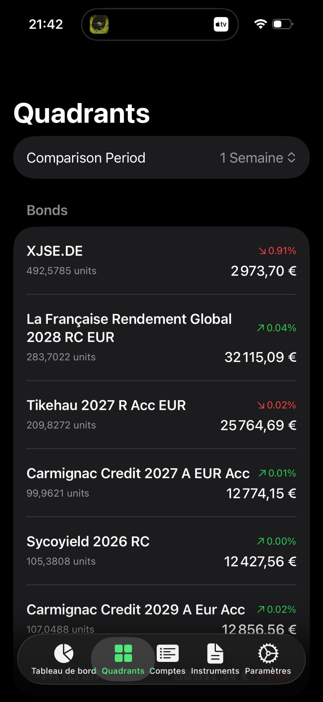
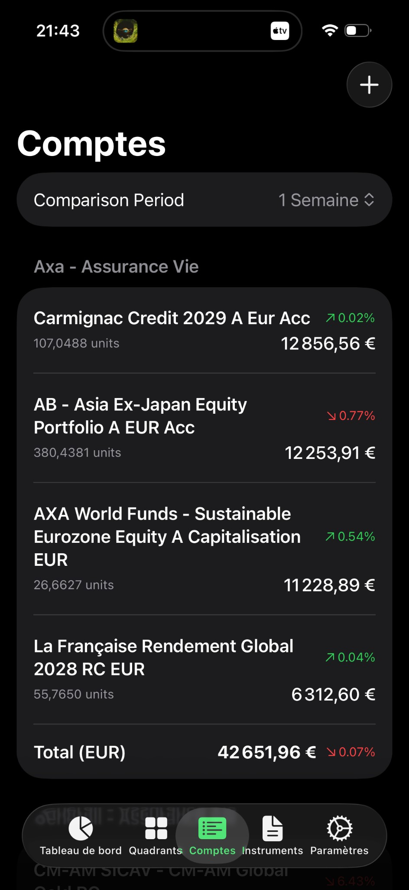

# Portfolio - Suivi de Portefeuille

[](LICENSE)
[](https://developer.apple.com/ios/)
[](https://developer.apple.com/macos/)
[](https://swift.org)

**Portfolio** est un outil complet de suivi de portefeuille, axé sur la confidentialité, pour gérer vos actifs financiers. Suivez vos actions, ETF, OPCVM (fonds communs de placement), métaux précieux, cryptomonnaies et comptes bancaires—le tout en un seul endroit avec de magnifiques applications natives pour iOS et macOS.

---

## Table des Matières

- [Aperçu](#aperçu)
- [Fonctionnalités Clés](#fonctionnalités-clés)
- [Types d'Actifs Supportés](#types-dactifs-supportés)
- [Pour Commencer](#pour-commencer)
  - [Application iOS & macOS](#application-ios--macos)
  - [Interface en Ligne de Commande](#interface-en-ligne-de-commande)
- [Guide Utilisateur](#guide-utilisateur)
  - [Tableau de Bord](#tableau-de-bord)
  - [Gestion des Instruments](#gestion-des-instruments)
  - [Comptes Bancaires & Positions](#comptes-bancaires--positions)
  - [Quadrants (Organisation du Portefeuille)](#quadrants-organisation-du-portefeuille)
  - [Rapports & Analytique](#rapports--analytique)
  - [Gestion des Prix](#gestion-des-prix)
  - [Paramètres & Préférences](#paramètres--préférences)
- [Sources de Données](#sources-de-données)
- [Confidentialité & Sécurité](#confidentialité--sécurité)
- [Automatisation](#automatisation)
- [Développement](#développement)
- [Licence](#licence)

---

## Aperçu

Portfolio vous aide à prendre le contrôle de votre portefeuille d'investissement en consolidant tous vos actifs financiers dans une vue unique et unifiée. Que vous suiviez des actions chez plusieurs courtiers, surveilliez vos pièces d'or ou analysiez la performance de vos OPCVM, Portfolio fournit les outils dont vous avez besoin.

### Captures d'écran

#### iOS

<p float="left">
  
  
</p>

### Pourquoi Portfolio ?

- **Suivi Tout-en-Un** : Actions, ETF, OPCVM, cryptomonnaies, métaux précieux et comptes bancaires dans une seule application
- **Données Précises** : Récupère les valeurs liquidatives (VL) réelles pour les OPCVM (pas de prix de bourse obsolètes) et inclut les primes de marché pour l'or/argent physique
- **Support Multi-Devises** : Conversion automatique USD/EUR avec taux de change historiques
- **Priorité à la Confidentialité** : Toutes les données sont stockées localement sur votre appareil—aucun compte cloud requis
- **Expérience Native** : Belles applications SwiftUI optimisées pour iOS et macOS
- **Accès Hors Ligne** : Consultez votre portefeuille à tout moment, même sans connexion internet

---

## Fonctionnalités Clés

### Gestion de Portefeuille
- **Support Multi-Comptes** : Suivez vos positions sur plusieurs comptes bancaires et courtiers
- **Suivi du Prix de Revient** : Enregistrez les dates et prix d'achat pour des calculs précis de gains/pertes
- **Organisation par Quadrants** : Groupez les instruments par catégorie (Technologie, Métaux Précieux, Revenu Fixe, etc.)

### Analytique & Rapports
- **Comparaison de Performance** : Comparez votre portefeuille sur différentes périodes (1 jour, 1 semaine, 1 mois, 1 an, depuis le début de l'année)
- **Graphiques Interactifs** : Visualisez les tendances du portefeuille, la répartition et l'historique des prix des instruments individuels
- **Valorisation en Or** : Voyez la valeur de votre portefeuille en onces d'or pour une perspective ajustée à l'inflation

### Gestion des Données
- **Récupération Intelligente** : Sélectionne automatiquement la meilleure source de données pour chaque type d'instrument
- **Récupération d'Historique** : Importez des années de données historiques pour une analyse complète des tendances
- **Mises à jour en Arrière-plan** : Mises à jour automatiques des prix sur macOS et iOS

### Expérience Utilisateur
- **Mode Privé** : Masquez rapidement les valeurs sensibles tout en gardant l'application fonctionnelle
- **Support Bilingue** : Localisation complète en anglais et français
- **Mode Sombre** : Support natif des préférences d'apparence du système

---

## Types d'Actifs Supportés

| Type d'Actif | Exemples | Source de Données | Notes |
|------------|----------|-------------|-------|
| **Actions** | Apple (AAPL), Tesla (TSLA) | Yahoo Finance | Prix du marché en temps réel |
| **ETF** | MSCI World, S&P 500 | Yahoo Finance | Fonds négociés en bourse |
| **OPCVM (Fonds Mutuels)** | Amundi, Carmignac | Financial Times | VL précise via Morningstar |
| **Cryptomonnaies** | Bitcoin, Ethereum | Yahoo Finance | Paires crypto majeures |
| **Métaux Précieux** | Or, Argent | Veracash | Prix spot en EUR/gramme |
| **Pièces Or & Argent** | Napoléon, Vera Max | AuCOFFRE | Inclut les primes de marché |
| **Comptes Bancaires** | Saisie manuelle | N/A | Suivi de la position cash |

### Types d'Instruments Spéciaux

#### Métaux Précieux (Veracash)
Suivez les prix spot pour l'or et l'argent par gramme en EUR :
- `VERACASH:GOLD_SPOT` - Prix spot de l'or
- `VERACASH:GOLD_PREMIUM` - Prix de la prime or
- `VERACASH:SILVER_SPOT` - Prix spot de l'argent

#### Pièces Physiques (AuCOFFRE)
Les pièces physiques incluent des primes de marché qui varient selon la demande :
- `COIN:NAPOLEON_20F` - Napoléon 20F Marianne Coq (~5.8g or pur)
- `COIN:VERAMAX_GOLD_1/10OZ` - Vera Max 1/10 oz or
- `COIN:GECKO_SILVER_1OZ` - Vera Silver Gecko 1 oz
- `COIN:GOLD_BAR_1OZ` - Lingot d'or 1 oz (estimation spot)

---

## Pour Commencer

### Application iOS & macOS

L'application native SwiftUI offre la meilleure expérience pour suivre votre portefeuille.

#### Prérequis Système
- **iOS** : iOS 17.0 ou ultérieur (iPhone et iPad)
- **macOS** : macOS 14.0 Sonoma ou ultérieur

#### Installation depuis Xcode

1. Clonez le dépôt :
   ```bash
   git clone https://github.com/jeremycalles/Portfolio.git
   cd Portfolio
   ```

2. Ouvrez le projet Xcode :
   ```bash
   open PortfolioMultiplatform.xcodeproj
   ```

3. Sélectionnez votre cible :
   - **Portfolio iOS** pour iPhone/iPad
   - **Portfolio macOS** pour Mac

4. Compilez et exécutez (`Cmd+R`)

#### Premier Lancement

Lors du premier lancement de Portfolio :
1. L'application crée une base de données SQLite locale pour vos données
2. Votre langue préférée est détectée à partir des paramètres système
3. Vous pouvez commencer à ajouter des instruments et des comptes bancaires immédiatement

### Interface en Ligne de Commande

Pour les utilisateurs avancés et l'automatisation, Portfolio peut inclure une CLI Python (optionnel ; tous les actifs ne sont pas dans ce dépôt). Ce qui suit est pour référence si vous avez ou ajoutez une CLI.

#### Prérequis
- Python 3.8 ou ultérieur
- pip (gestionnaire de paquets Python)

#### Installation

```bash
# Naviguez vers le répertoire du projet (après clonage)
cd Portfolio

# Créez et activez l'environnement virtuel
python3 -m venv venv
source venv/bin/activate  # Windows : venv\Scripts\activate

# Installez les dépendances
pip install -r requirements.txt

# Initialisez la base de données (si CLI disponible)
python3 src/main.py init
```

---

## Guide Utilisateur

### Tableau de Bord

Le Tableau de Bord est votre centre de commande, offrant un aperçu instantané de votre position financière.

#### Résumé du Portefeuille
En haut, vous verrez :
- **Valeur Totale du Portefeuille** : Somme de toutes les positions converties en EUR
- **Équivalent Or** : La valeur de votre portefeuille exprimée en onces d'or (utilisant le prix spot actuel)
- **Variation sur la Période** : Variation en pourcentage par rapport à votre période de comparaison sélectionnée

#### Périodes de Comparaison
Utilisez le sélecteur de période pour comparer votre portefeuille par rapport à :
- **1 Jour** : Valeurs de clôture d'hier
- **1 Semaine** : Valeurs d'il y a 7 jours
- **1 Mois** : Valeurs d'il y a 30 jours
- **1 An** : Valeurs d'il y a 365 jours
- **1er Janvier** : Valeurs depuis le début de l'année

#### Graphique du Portefeuille
Le graphique interactif montre la valeur de votre portefeuille dans le temps :
- **Graphique Linéaire** : Suivez la tendance de la valeur totale de votre portefeuille
- **Plages de Temps** : 1M, 3M, 6M, 1er Janv, 1A, 2A, Tout
- **Mode Or** : Basculez pour voir les valeurs en onces d'or au lieu de l'EUR

#### Vues de Répartition
Basculez entre différentes perspectives de répartition :
- **Par Quadrant** : Voyez comment votre portefeuille est distribué par catégorie d'actifs
- **Par Compte** : Visualisez la répartition entre vos comptes bancaires
- **Par Positions** : Détail par instrument individuel

#### Mode Privé
Basculez l'icône œil pour masquer les valeurs sensibles. L'application reste entièrement fonctionnelle mais affiche des valeurs masquées—utile lors de la consultation en public.

---

### Gestion des Instruments

Les instruments sont les actifs financiers que vous souhaitez suivre (actions, ETF, fonds, etc.).

#### Ajouter des Instruments

**Dans l'Application :**
1. Naviguez vers l'onglet **Instruments** (barre latérale macOS) ou **Portefeuille** (iOS)
2. Cliquez/appuyez sur le bouton **+**
3. Entrez l'identifiant :
   - **ISIN** (12 caractères) : ex : `LU0389656892` pour les OPCVM
   - **Ticker** : ex : `AAPL` pour les actions, `BTC-EUR` pour les cryptos
   - **Clé Spéciale** : ex : `VERACASH:GOLD_SPOT` pour les métaux précieux

**Via CLI :**
```bash
# Actions & ETF
python3 src/main.py add AAPL           # Par ticker
python3 src/main.py add US0378331005   # Par ISIN

# OPCVM
python3 src/main.py add LU1861134382   # Amundi MSCI World

# Cryptomonnaies
python3 src/main.py add BTC-EUR        # Bitcoin en EUR

# Métaux Précieux
python3 src/main.py add VERACASH:GOLD_SPOT

# Pièces Physiques
python3 src/main.py add COIN:NAPOLEON_20F
```

#### Voir les Détails de l'Instrument

Cliquez/appuyez sur n'importe quel instrument pour voir :
- **Prix Actuel** : Dernier prix récupéré avec la devise
- **Historique des Prix** : Prix historiques en format tableau ou graphique
- **Quadrant Assigné** : Groupement par catégorie
- **Positions** : Quels comptes détiennent cet instrument

#### Supprimer des Instruments

**Important :** Supprimer un instrument retire tout l'historique de prix et les positions associés.

1. Sélectionnez l'instrument
2. Cliquez/appuyez sur le bouton supprimer (icône poubelle)
3. Confirmez la suppression

---

### Comptes Bancaires & Positions

Suivez vos investissements sur plusieurs courtiers et comptes.

#### Ajouter des Comptes Bancaires

**Dans l'Application :**
1. Naviguez vers la section **Comptes**
2. Cliquez/appuyez sur le bouton **+**
3. Entrez :
   - **Nom** : Nom du compte (ex : "TradeRepublic")
   - **Type** : Type de compte (ex : "CTO", "PEA", "Compte Courant")

**Via CLI :**
```bash
python3 src/main.py add-account "TradeRepublic" "CTO"
python3 src/main.py add-account "Boursorama" "PEA"
```

#### Ajouter des Positions

Les positions représentent combien d'unités d'un instrument vous possédez dans chaque compte.

**Dans l'Application :**
1. Naviguez vers la section **Positions**
2. Cliquez/appuyez sur le bouton **+**
3. Sélectionnez :
   - **Compte** : Quel compte bancaire
   - **Instrument** : Quel actif
   - **Quantité** : Nombre d'unités
   - **Date d'Achat** (optionnel) : Quand vous avez acheté
   - **Prix d'Achat** (optionnel) : Prix par unité à l'achat

**Via CLI :**
```bash
# Position simple
python3 src/main.py add-holding "TradeRepublic" AAPL 10

# Avec suivi d'achat
python3 src/main.py add-holding "TradeRepublic" BTC-EUR 0.5 \
  --purchase-date 2024-01-15 \
  --purchase-price 35000
```

#### Voir les Positions

La vue Positions montre :
- **Groupé par Compte** : Voir tous les instruments dans chaque compte
- **Valeur Actuelle** : Quantité × prix actuel
- **Gain/Perte** : Si les données d'achat sont enregistrées, voir les gains latents

#### Vue Toutes les Positions

Accédez à la vue consolidée pour voir :
- Toutes les positions sur tous les comptes
- La valeur totale du portefeuille
- Sections de compte extensibles

---

### Quadrants (Organisation du Portefeuille)

Les Quadrants vous aident à catégoriser et analyser votre portefeuille par type d'actif ou stratégie.

#### Créer des Quadrants

Catégories de quadrants suggérées :
- **Technologie** : Actions tech et ETF
- **Métaux Précieux** : Or, argent et pièces
- **Revenu Fixe** : Obligations et fonds monétaires
- **International** : Marchés émergents et actions étrangères
- **Immobilier** : REITs et fonds immobiliers

**Dans l'Application :**
1. Naviguez vers la section **Quadrants**
2. Cliquez/appuyez sur le bouton **+**
3. Entrez un nom pour le quadrant

**Via CLI :**
```bash
python3 src/main.py add-quadrant "Technologie"
python3 src/main.py add-quadrant "Métaux Précieux"
```

#### Assigner des Instruments aux Quadrants

**Dans l'Application :**
1. Sélectionnez un instrument
2. Choisissez un quadrant depuis le menu déroulant/sélecteur

**Via CLI :**
```bash
python3 src/main.py assign-quadrant AAPL "Technologie"
python3 src/main.py assign-quadrant "VERACASH:GOLD_SPOT" "Métaux Précieux"
```

#### Rapports par Quadrant

Voyez votre portefeuille groupé par quadrant :
- Valeur sous-totale par quadrant
- Pourcentage du portefeuille total
- Variation de performance par quadrant
- Visualisation en diagramme circulaire

---

### Rapports & Analytique

#### Rapport de Portefeuille

Le Rapport de Portefeuille montre une analyse détaillée de vos positions :

| Colonne | Description |
|--------|-------------|
| Instrument | Nom et identifiant |
| Quantité | Unités détenues |
| Prix Actuel | Dernier prix |
| Valeur Actuelle | Quantité × prix en EUR |
| Variation | Variation en pourcentage vs période de comparaison |

**Périodes de Comparaison :**
- `1 Jour` : Comparer à hier
- `1 Semaine` : Comparer à il y a 7 jours
- `1 Mois` : Comparer à il y a 30 jours
- `1 An` : Comparer à il y a 365 jours
- `1er Janv` : Comparer au 1er Janvier

**Via CLI :**
```bash
python3 src/portfolio_report.py "TradeRepublic" --period 1Year
```

#### Rapport par Quadrant

Voyez votre portefeuille organisé par catégorie :
- Positions groupées sous chaque quadrant
- Sous-totaux par quadrant avec pourcentages de variation
- Total général sur tous les quadrants
- Section instruments non assignés

**Via CLI :**
```bash
python3 src/quadrant_report.py --period 1Year
python3 src/quadrant_report.py "Métaux Précieux" --period 1Week
```

#### Graphiques de Prix

Graphiques interactifs pour les instruments individuels :
- **Plages de Temps** : 1M, 3M, 6M, 1er Janv, 1A, 2A, Tout
- **Statistiques** : Min, Max, Moyenne, Points de Données
- **Courbes Lisses** : Interpolation Catmull-Rom pour une meilleure visualisation

---

### Gestion des Prix

#### Mises à jour Automatiques

Portfolio récupère automatiquement les derniers prix depuis les sources de données.

**Mise à jour Manuelle :**
- **Dans l'App** : Paramètres → Mettre à jour tous les prix
- **Via CLI** : `python3 src/main.py update`

#### Récupération d'Historique

Importez des données historiques pour l'analyse de tendance :

**Dans l'Application :**
1. Allez dans Paramètres
2. Sélectionnez "Récupérer l'historique"
3. Choisissez la période (1A, 2A, 5A, Max)

**Via CLI :**
```bash
# Année dernière, données mensuelles
python3 src/main.py backfill-historical

# 5 dernières années, données hebdomadaires
python3 src/main.py backfill-historical --period 5y --interval 1wk

# Historique maximum disponible
python3 src/main.py backfill-historical --period max
```

#### Saisie Manuelle de Prix

Pour les instruments sans sources de données automatiques :
1. Naviguez vers **Historique des Prix**
2. Sélectionnez l'instrument
3. Cliquez/appuyez sur **+** pour ajouter un nouveau prix
4. Entrez la date et la valeur du prix

---

### Paramètres & Préférences

#### Langue

Basculez entre Anglais et Français :
1. Allez dans **Paramètres**
2. Sélectionnez **Langue**
3. Choisissez votre langue préférée

L'application se met à jour immédiatement sans redémarrage.

#### Emplacement de la Base de Données (macOS)

Choisissez où stocker vos données :
- **Stockage Local** : Dossier documents de l'application par défaut
- **iCloud Drive** : Synchronisation entre appareils (nécessite le Programme Développeur Apple)
- **Emplacement Personnalisé** : N'importe quel dossier sur votre Mac

#### Actualisation en Arrière-plan (macOS)

Activez les mises à jour automatiques des prix :
1. Allez dans **Paramètres** → **Actualisation en Arrière-plan**
2. Activez l'agent de lancement
3. Les prix se mettent à jour automatiquement toutes les 3 heures

Sur macOS, le stockage local et les scripts/logs d'actualisation en arrière-plan utilisent la racine du projet résolue comme `$HOME/github/Portfolio`. Cloner ou faire un lien symbolique du dépôt à cet endroit garde les chemins cohérents.

#### Tâches en Arrière-plan (iOS)

iOS actualise automatiquement les prix en arrière-plan quand le système le permet. Voir l'historique d'actualisation dans les Paramètres pour surveiller le statut des mises à jour.

---

## Sources de Données

Portfolio utilise plusieurs sources de données pour assurer une tarification précise :

| Source | Actifs | Type de Données |
|--------|--------|-----------|
| **Yahoo Finance** | Actions, ETF, Crypto | Prix temps réel, données historiques |
| **Financial Times** | OPCVM | VL depuis Morningstar |
| **Veracash** | Or, Argent | Prix spot en EUR/gramme |
| **AuCOFFRE** | Pièces Physiques | Prix avec primes de marché |

### Pourquoi Plusieurs Sources ?

- **OPCVM** : Les prix de bourse sont souvent obsolètes en raison de la faible liquidité. Financial Times fournit la VL (Valeur Liquidative) précise depuis Morningstar.
- **Pièces Physiques** : Contrairement aux prix spot, les pièces s'échangent avec des primes qui varient selon la demande, la rareté et les conditions du marché. AuCOFFRE fournit les prix réels du marché incluant ces primes.

---

## Confidentialité & Sécurité

### Conception Local-First

- **Pas de Comptes Cloud** : Vos données restent sur votre appareil
- **Pas de Télémétrie** : Aucune donnée d'utilisation n'est collectée ou transmise
- **Contrôle Total** : Exportez, sauvegardez ou supprimez vos données à tout moment

### Stockage des Données

- Toutes les données stockées dans une base de données SQLite locale
- Emplacement de la base de données : Dossier Documents de l'application (personnalisable sur macOS)
- Synchronisation iCloud optionnelle pour l'accès inter-appareils

### Mode Privé

Masquez les valeurs sensibles instantanément :
- Basculez avec l'icône œil
- Toutes les valeurs monétaires masquées
- L'application reste entièrement fonctionnelle
- Parfait pour la consultation en public

---

## Automatisation

### Mises à jour Quotidiennes (Cron)

Automatisez la récupération des prix sur macOS/Linux :

```bash
# Éditez la crontab
crontab -e

# Ajoutez cette ligne (utilise $HOME ; mettez à jour si votre chemin de clone diffère)
0 18 * * * cd "$HOME/github/Portfolio" && "$HOME/github/Portfolio/venv/bin/python3" src/main.py update >> "$HOME/github/Portfolio/update.log" 2>&1
```

Ceci exécute la mise à jour chaque jour à 18h.

### Agent de Lancement macOS

L'application peut installer un agent de lancement pour les mises à jour automatiques en arrière-plan :
1. Ouvrez **Paramètres** → **Actualisation en Arrière-plan**
2. Activez l'agent de lancement
3. Les prix se mettent à jour automatiquement toutes les 3 heures

### Actualisation en Arrière-plan iOS

iOS utilise le framework Background Tasks du système :
- Intervalle minimum de 3 heures entre les mises à jour
- Le système détermine le moment réel basé sur les habitudes d'utilisation
- Voir l'historique d'actualisation dans les Paramètres

---

## Développement

### Structure du Projet

```
Portfolio/
├── Shared/                       # Code partagé
│   ├── Models/                   # Modèles de données
│   ├── Services/                 # Base de données, API, Langue
│   ├── ViewModels/               # Logique métier
│   ├── Views/                    # Vues SwiftUI
│   └── Resources/                # Fichiers de localisation
├── iOS/                          # Code spécifique iOS
├── macOS/                        # Code spécifique macOS
├── PortfolioTests/               # Tests unitaires & snapshot
├── PortfolioMultiplatform.xcodeproj/
├── data/                         # Stockage base de données (macOS local)
├── requirements.txt              # Dépendances Python (CLI optionnel)
└── README.md
```

### Exécution des Tests

**Depuis Xcode :**
- Appuyez sur `Cmd+U` pour lancer tous les tests
- Utilisez le Navigateur de Tests (`Cmd+6`) pour les tests individuels

**Depuis la Ligne de Commande :**
```bash
# Tests iOS
xcodebuild test \
  -project PortfolioMultiplatform.xcodeproj \
  -scheme "Portfolio iOS" \
  -destination 'platform=iOS Simulator,name=iPhone 15'

# Tests macOS
xcodebuild test \
  -project PortfolioMultiplatform.xcodeproj \
  -scheme "Portfolio macOS" \
  -destination 'platform=macOS'
```

### Structure des Tests

| Fichier | Objectif |
|------|---------|
| `PortfolioTests.swift` | Configuration de test basique |
| `CurrencyConversionTests.swift` | Logique de conversion de devises |
| `DashboardSnapshotTests.swift` | Tests snapshot UI |
| `TestFixtures.swift` | Données de test |
| `MockDatabaseService.swift` | Services simulés (mock) |

---

## Licence

Ce projet est sous licence [PolyForm Noncommercial License 1.0.0](LICENSE).

**Résumé :**
- ✅ **Gratuit pour usage non-commercial** — projets personnels, recherche, éducation, usage amateur
- ✅ **Modifications autorisées** — vous pouvez modifier et distribuer à des fins non-commerciales
- ❌ **Usage commercial nécessite permission** — contactez pour une licence commerciale

---

## Support

Pour des questions, problèmes, ou demandes de fonctionnalités, veuillez ouvrir un ticket sur GitHub.

---

*Fait avec ❤️ en utilisant SwiftUI et Python*
